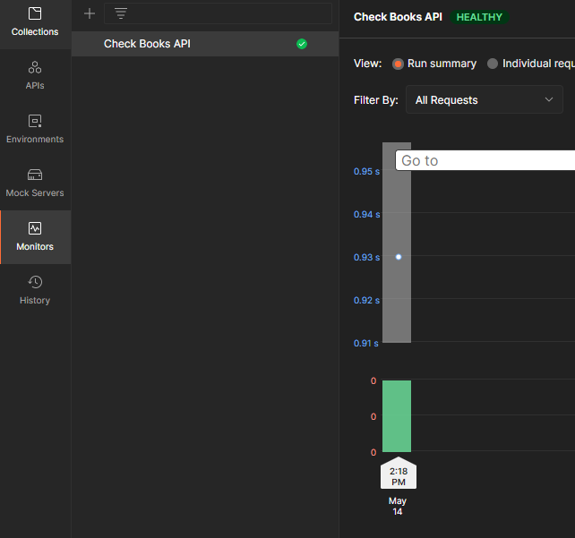

# Automatic-API-Testing-using-Postman

This is automatic API testing built with the postman. You can write your tests and schedule the automatic testing whenever you need and the report will be sent through the mail.
<br>
<p align="center">
    
</p>

### Table of Contents

- [Description](#description)
- [Working Image](#Working-Images)
- [Project Layout](#project-layout)
- [References](#references)
- [Author Info](#author-info)

---

## Description

API testing is a software testing type that validates Application Programming Interfaces (APIs). The purpose of API Testing is to check the functionality, reliability, performance, and security of the programming

The Simple Book API I am using for this project is [this](https://github.com/vdespa/introduction-to-postman-course/blob/main/simple-books-api.md) 
<br>

### Services Used

- Postman
- Newman

### For Execution
Then clone the repository and install newman and run the below command in the terminal to get the detailed report.
<br>
 `newman run Book_API_postman_collection.json`

---

## Working Images
<br >
<p align="center">
    
    
</p>
<p align="center">
 
</p>

[Back To The Top](#Automatic-API-Testing-using-Postman)

---

## Project Layout

```
Automatic-API-Testing-using-Postman
├─ Book_API_postman_collection.json
├─ Complete.PNG
├─ Monitor_Results.PNG
├─ README.md
└─ Run_Summary.PNG

```

---

## References

- [Postman](https://www.postman.com/)
- [newman](https://www.npmjs.com/package/newman)
---

## Author Info

- LinkedIn - [Srinivas K](https://www.linkedin.com/in/srinivas-konduri/)
- Github - [Srinivas K](https://github.com/srinivaskool)

[Back To The Top](#Automatic-API-Testing-using-Postman)


